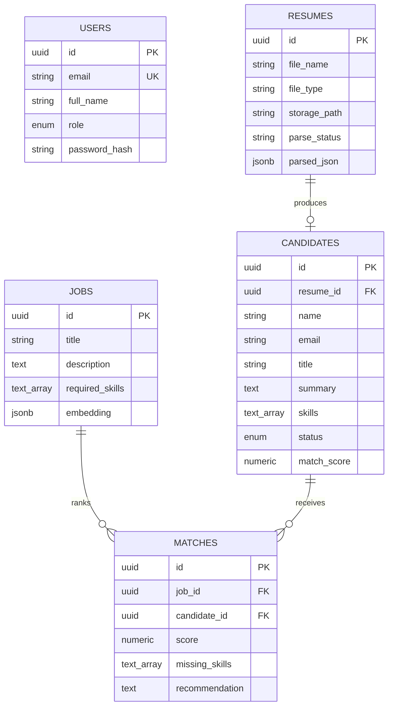

# ER Diagram

```mermaid
erDiagram
  USERS {
    uuid id PK
    string email UK
    string full_name
    enum role
    string password_hash
  }
  RESUMES {
    uuid id PK
    string file_name
    string file_type
    string storage_path
    string parse_status
    jsonb parsed_json
  }
  CANDIDATES {
    uuid id PK
    uuid resume_id FK
    string name
    string email
    string title
    text summary
    text_array skills
    enum status
    numeric match_score
  }
  JOBS {
    uuid id PK
    string title
    text description
    text_array required_skills
    jsonb embedding
  }
  MATCHES {
    uuid id PK
    uuid job_id FK
    uuid candidate_id FK
    numeric score
    text_array missing_skills
    text recommendation
  }
  RESUMES ||--o| CANDIDATES : produces
  JOBS ||--o{ MATCHES : ranks
  CANDIDATES ||--o{ MATCHES : receives
```
